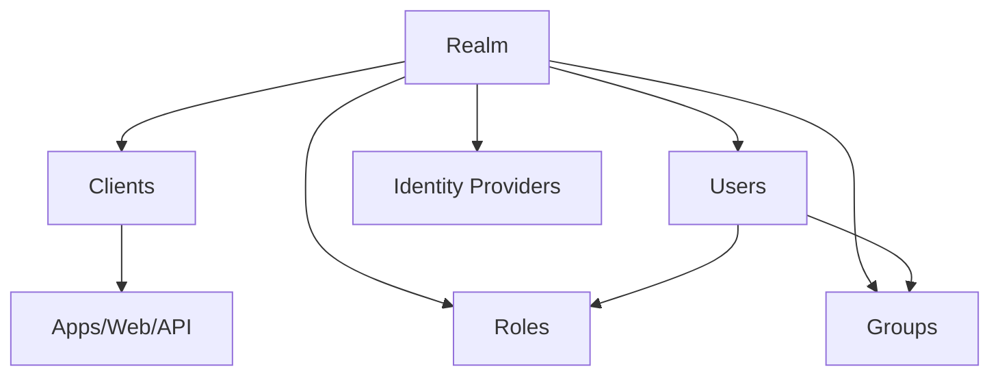
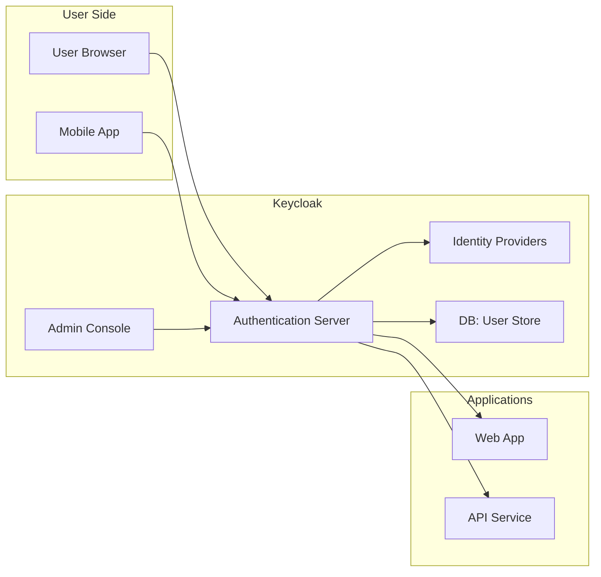

# مستند آموزشی مقدماتی و حرفه‌ای Keycloak

---

## ۱. مقدمه مقدماتی (برای کسی که شناخت سطحی دارد)

فرض کن در یک شرکت چندین نرم‌افزار مختلف استفاده می‌کنی:

* یک **سیستم ایمیل داخلی**
* یک **سیستم مدیریت پروژه (مثلاً Jira)**
* یک **داشبورد مالی**
* یک **اپلیکیشن موبایل مشتریان**

اگر برای هرکدام جداگانه نام کاربری و رمز بسازی، مشکلاتی پیش می‌آید:

* کاربر باید چندین پسورد به خاطر بسپارد.
* اگر کارمند شرکت تغییر کند، باید در همه سیستم‌ها دستی حسابش غیرفعال شود.
* امنیت کاهش می‌یابد چون افراد پسوردها را تکراری می‌گذارند.

**اینجاست که Keycloak وارد می‌شود:**

Keycloak مثل **در ورودی واحد** (Single Door) عمل می‌کند که همه سیستم‌ها پشت آن قرار دارند. کاربر یک بار وارد می‌شود و به همه سیستم‌ها دسترسی دارد.

به این می‌گویند: **Single Sign-On (SSO)**

---

## ۲. تعریف حرفه‌ای Keycloak

**Keycloak** یک **Identity and Access Management (IAM) Platform** متن‌باز است که توسط Red Hat توسعه داده شده.

ویژگی‌های اصلی:

* پشتیبانی از پروتکل‌های استاندارد هویت: **OAuth2, OpenID Connect, SAML**
* مدیریت **کاربران، نقش‌ها (Roles)، گروه‌ها (Groups)**
* ارائه **Single Sign-On (SSO)** و **Multi-Factor Authentication (MFA)**
* قابلیت **Identity Federation** (اتصال به LDAP، Active Directory، یا Google/Microsoft)
* **Self-hosted** (نصب روی سرور خودت با Docker/K8s یا VM)

---

## ۳. چه مشکلی را حل می‌کند و چرا به وجود آمد؟

* **چالش قبل از Keycloak** :
* کاربران باید در هر سرویس جداگانه حساب بسازند.
* مدیریت دستی کاربران در چند سیستم پیچیده است.
* امنیت پایین (پسورد ضعیف، مدیریت غیرمتمرکز).
* **چالش سازمان‌ها** :
* نیاز به یک نقطه مرکزی برای Authentication و Authorization.
* رعایت استانداردهای امنیتی (GDPR، HIPAA، SOC2).
* مدیریت چرخه عمر کاربر (Lifecycle Management).
* **Keycloak این مشکلات را حل می‌کند** با:
  * ورود یکپارچه (SSO)
  * مدیریت مرکزی کاربران
  * اتصال به منابع بیرونی (LDAP/AD)
  * افزایش امنیت با MFA و Session Management

---

## ۴. آیا انواع و تایپ‌های مختلفی دارد؟

* Keycloak خودش یک محصول واحد است، ولی در **مدل‌های استقرار مختلف** عرضه می‌شود:
  1. **Standalone** (روی یک سرور یا Docker container)
  2. **Clustered** (روی چند نود برای High Availability)
  3. **Kubernetes Operator** (نسخه بومی‌سازی‌شده برای K8s)
* همچنین قابلیت **Multi-Tenancy** دارد:
  * هر سازمان یا اپلیکیشن می‌تواند یک **Realm** جدا داشته باشد (مثل namespace برای کاربران و تنظیمات).

---

## ۵. اجزاء و بخش‌های تشکیل‌دهنده Keycloak

* **Realm** → محدوده‌ای مستقل برای مدیریت هویت (مثل یک شرکت یا پروژه).
* **Client** → اپلیکیشنی که به Keycloak متصل می‌شود (مثلاً وب‌سایت، API، موبایل).
* **User** → کاربر انسانی یا سرویس.
* **Role** → نقش‌هایی که به کاربر یا گروه داده می‌شود (مثلاً admin, editor, viewer).
* **Group** → دسته‌بندی کاربران.
* **Identity Provider (IdP)** → منبع خارجی هویت (Google, LDAP, Facebook).
* **Authentication Flow** → مراحل ورود (مثلاً: username/password → MFA → grant token).
* **Token** → مدرک دیجیتال (JWT, Refresh Token) برای دسترسی.

### دیاگرام ساختار (Mermaid)

---

## ۶. کاربردها و مثال‌های واقعی

1. **سازمان داخلی** : کارمندان یک شرکت با ورود به Keycloak به ایمیل، CRM، ERP و Jira دسترسی پیدا می‌کنند.
2. **سرویس SaaS** : مشتریان با یک حساب می‌توانند هم به اپلیکیشن وب و هم اپلیکیشن موبایل متصل شوند.
3. **پروژه دولتی** : کاربران با حساب ملی خود وارد چندین سامانه دولتی می‌شوند.
4. **Startup محصولی** : پیاده‌سازی Login با Google/Facebook به‌وسیله Keycloak.
5. **بانکداری** : مشتری با احراز هویت چندمرحله‌ای وارد اینترنت‌بانک و اپلیکیشن موبایل می‌شود.

---

## ۷. معماری Keycloak

Keycloak معماری **modular و extensible** دارد:

* **Core** : موتور اصلی مدیریت هویت و نشست‌ها.
* **Storage** : دیتابیس (معمولاً PostgreSQL/MySQL).
* **Identity Providers** : ادغام با منابع خارجی.
* **Admin Console** : داشبورد وب مدیریتی.
* **Adapters** : ماژول‌هایی برای ادغام در اپلیکیشن‌ها (Java, Node.js, Spring, Django).

### دیاگرام معماری ساده

---

## ۸. مفاهیم وابسته (جدول)

| مفهوم                        | تعریف                                     | مثال                                                                                              |
| --------------------------------- | ---------------------------------------------- | ----------------------------------------------------------------------------------------------------- |
| **SSO (Single Sign-On)**    | ورود یک‌باره به چند سیستم | ورود به Gmail و دسترسی به Drive و YouTube                                             |
| **OAuth2**                  | پروتکل مجوز دسترسی             | اپلیکیشن موبایل اجازه دسترسی به پروفایل توییتر می‌گیرد |
| **OIDC (OpenID Connect)**   | لایه هویت روی OAuth2                | ورود با حساب Google به یک وب‌سایت                                                |
| **SAML**                    | پروتکل قدیمی‌تر برای SSO     | اتصال Keycloak به Active Directory                                                             |
| **MFA (Multi-Factor Auth)** | ورود چندمرحله‌ای                | رمز عبور + پیامک یا Google Authenticator                                                |
| **Federation**              | اتصال به سرویس هویت خارجی | اتصال Keycloak به LDAP سازمان                                                            |
| **Token**                   | مدرک دیجیتال دسترسی           | JWT در هدر Authorization یک API                                                                |

---

## ۹. جمع‌بندی

* Keycloak یک **راهکار Enterprise-grade IAM متن‌باز** است.
* برای **سازمان‌ها، شرکت‌ها و محصولات SaaS** بسیار ارزشمند است.
* ویژگی اصلی:  **SSO، MFA، Federation، مدیریت مرکزی کاربران** .
* یادگیری‌اش کمی زمان‌بر است اما ارزش زیادی دارد هم در **بازار ایران** و هم در  **بازار بین‌المللی** .

